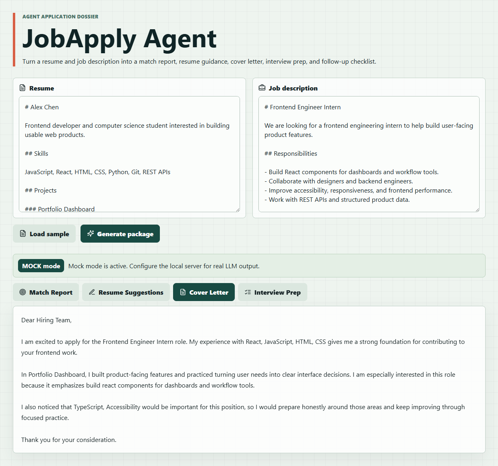
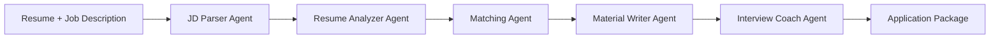

# JobApply Agent

[](https://github.com/3092054815-byte/JobApply-Agent/actions/workflows/ci.yml)
[](https://github.com/3092054815-byte/JobApply-Agent/actions/workflows/pages.yml)

JobApply Agent is a GitHub-showcase MVP for AI-assisted job applications. It turns a resume and target job description into a structured application package: match report, resume suggestions, cover letter, interview preparation, and follow-up checklist.

## What It Solves

Job seekers often need to read long job descriptions, identify relevant skills, adapt resume bullets, write cover letters, and prepare for interviews. JobApply Agent makes that workflow explicit and repeatable.

## Demo

Live demo: [https://3092054815-byte.github.io/JobApply-Agent/](https://3092054815-byte.github.io/JobApply-Agent/)

Run the project locally, click `Load sample`, then click `Generate package` to view the full workflow.



## Agent Workflow



## Features

- Resume and job description input.
- One-click sample data for reviewers.
- Explainable match score.
- Covered skill and missing skill analysis.
- Truthful resume rewrite suggestions.
- Tailored cover letter.
- Interview questions and answer hints.
- Follow-up checklist.
- Mock mode that works without an API key.
- Optional local server boundary for real LLM mode.

## Run Locally

Use Node.js 20.19+ or 22.12+.

```bash
npm install
npm run dev
```

Open the local Vite URL shown in the terminal.

## Verify

```bash
npm test
npm run build
npm audit
```

## Optional Local API

```bash
cp .env.example .env
npm run server
```

The MVP keeps API keys on the local server side. The browser does not store provider keys.

## Example Files

- `examples/resume_sample.md`
- `examples/jd_sample.md`
- `examples/output_sample.json`

## Application Description

For a Chinese application-form-ready project summary, see [`docs/application-description.md`](docs/application-description.md).

## Project Structure

```text
src/
  agents/      Agent role modules
  components/  Demo interface
  lib/         Schemas, scoring, pipeline, API boundary
server/        Optional local API
examples/      Sample inputs and output
docs/          Architecture and Agent flow notes
```

## Ethical Design

The system does not fabricate experience. It helps users reframe real experience, identify gaps, and prepare honestly for applications.

## Future Work

- PDF and DOCX resume parsing.
- Export application packages to markdown or PDF.
- Interview answer practice with feedback.
- RAG over a user's portfolio and past projects.
- Job application tracking.
